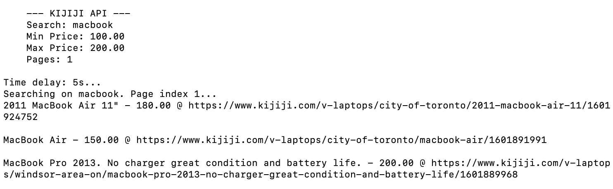

# kijiji
Just a friendly school project. No harm intended.

## Setup
```
cd ../../kijiji/
python3 -m pip install virtualenv
python3 -m virtualenv env
source env/bin/activate
pip install -r requirements.txt
```

## Run
```
python kijiji.py --search=macbook --min_price=100.00 --max_price=200.00 --pages=1
```

# Example
